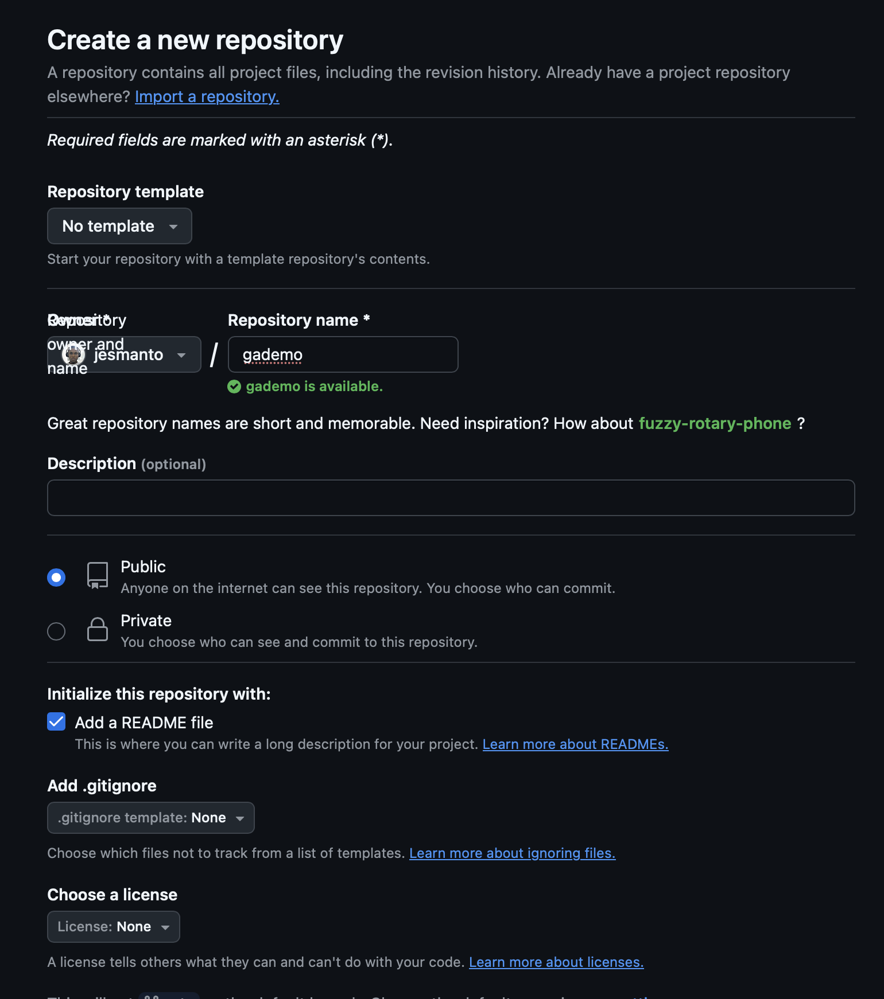
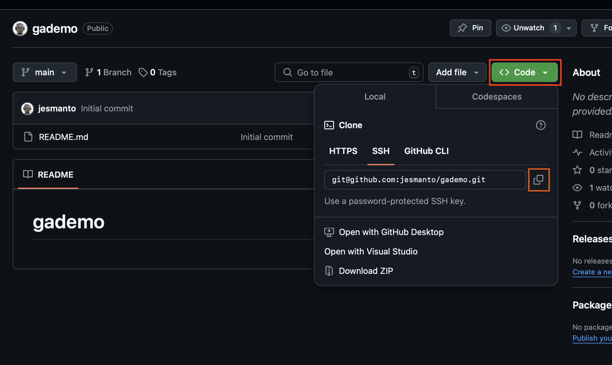
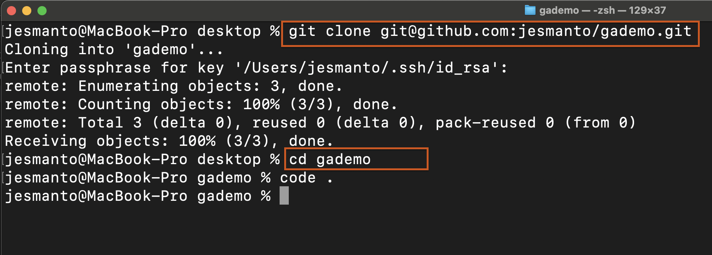
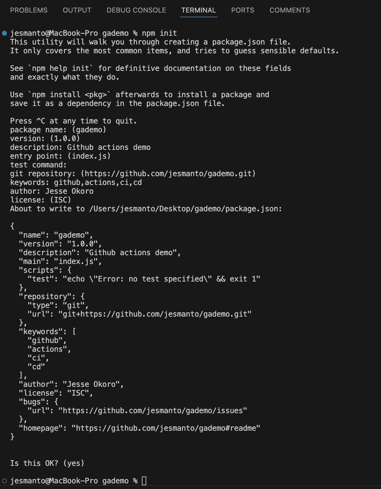

# gademo

## Initialize a Github Repository
- Click the `+` ison on your github page and select `new repository`
- Provide the name of the project and select `Add ReadMe`
    

- Copy the repository url
    

- Head to your terminal and clone the repository. And open your project in VS Code by running `code .`
    

## Create a Simple Node.js Application
### Initialize node
- On VS code, click on `Terminal` and select `New Terminal`.
- On the terminal run `npm init` to initialize a node project.
- The package manage prompts you to define the `name`, `version`, `description` and other information about the project.

    
- This process will generate `package.json` file in the project root directory.

### Write code
- Create an index.js using `touch index.js` on the terminal
- Copy the code snippet below in to index.js file.
    ```
    // Example: index.js
    const express = require('express');
    const app = express();
    const port = process.env.PORT || 3000;

    app.get('/', (req, res) => {
    res.send('Hello World!');
    });

    app.listen(port, () => {
    console.log(`App listening at http://localhost:${port}`);
    });

    ```
## Writing Your First Github Action Workflow
- Create a new directory called `.github`
    ```
    mkdir .github
    ```
- Create another directory called `workflows` as a sub-directory to `.github`, to achieve a `.github/workflows` file structure.
    ```
    cd .github
    mkdir workflows
    ```
- Create a file named `gademo.yml` which will contain the workfow.

    ```
    cd workflows
    touch gademo.yml
    ```
### Let's create a workflow
- Give a name to the workflow
    ```
    name: Node.js CI
    ```
- Specify the event to trigger the workflow. The snippet below shows that the workflow will trigger at a push event to the main branch. This is using the `on` term.
    ```
    on:
        push:
            branches: [main]
        pull_request:
            branches: [main]
    ```

- Define the jobs that the workflow will execute. This part defines the workflow from code integration to code testing
    ```
    jobs:
    build:

    runs-on: ubuntu-latest

    strategy:
    matrix:
        node-version: [14.x, 16.x]

    steps:
    uses: actions/checkout@v2

    name: Use Node.js ${{ matrix.node-version }}
    uses: actions/setup-node@v1
    with:
        node-version: ${{ matrix.node-version }}

    run: npm ci

    run: npm run build --if-present

    run: npm test
    ```
- Here is the full workflow

    ```
    # Name of the workflow
    name: Node.js CI

    # Specifies when the workflow should be triggered
    on:
    # Triggers the workflow on 'push' events to the 'main' branch
    push:
        branches: [ main ]
    # Also triggers the workflow on 'pull_request' events targeting the 'main' branch
    pull_request:
        branches: [ main ]

    # Defines the jobs that the workflow will execute
    jobs:
    # Job identifier, can be any name (here it's 'build')
    build:
        # Specifies the type of virtual host environment (runner) to use
        runs-on: ubuntu-latest

        # Strategy for running the jobs - this section is useful for testing across multiple environments
        strategy:
        # A matrix build strategy to test against multiple versions of Node.js
        matrix:
            node-version: [14.x, 16.x]

        # Steps represent a sequence of tasks that will be executed as part of the job
        steps:
        # Checks-out your repository under $GITHUB_WORKSPACE, so the job can access it
        uses: actions/checkout@v2

        # Sets up the specified version of Node.js
        name: Use Node.js ${{ matrix.node-version }}
        uses: actions/setup-node@v1
        with:
            node-version: ${{ matrix.node-version }}

        # Installs node modules as specified in the project's package-lock.json
        run: npm ci

        # (This command will only run if a build script is defined in the package.json)
        run: npm run build --if-present

        # Runs tests as defined in the project's package.json
        run: npm test

    ```

### Explanation
1. `name`: This simply names your workflow. It's wht appears on Github when the workflow is running.
2. `on`: This section defines when the workflow is triggered. Here, it's set to activate on push and pull request events to the main branch.
3. `jobs`: Jobs are a set of steps that execute on the same runner. In example, there's one job named `build`.
4. `runs-on`: Defines the type of machine to run the job on. Here, it's using the latest Ubuntu virtual machine.
5. `strategy.matrix`: This allows you to run the job on multiple versions of Nodejs, ensuring compatibility.
6. `steps`: A sequence of tasks executed as part of the job 
